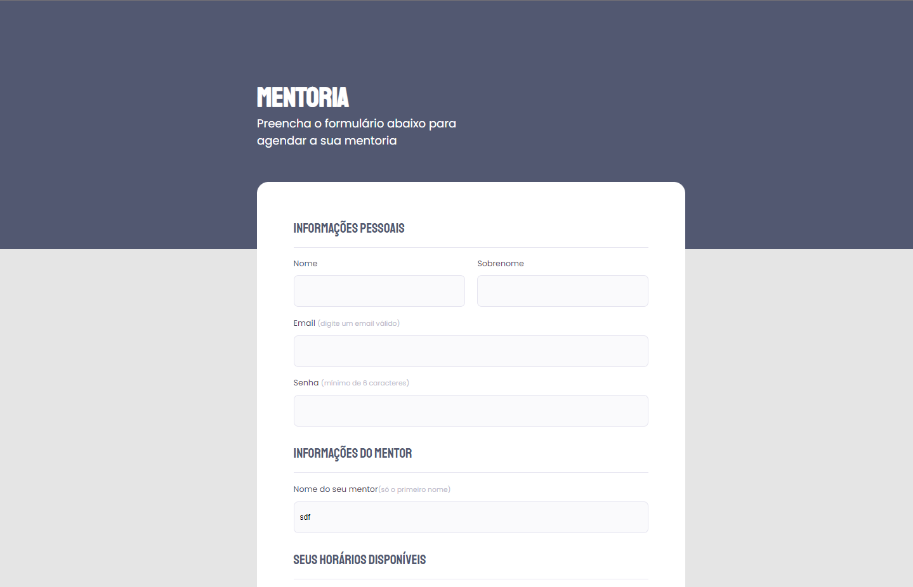

# <h1 align="center">Form Challenge 01</h1>

Form challenge 1 | Stage 03 - Rockeseat Explorer course

  <a href="#-Technologies">Technologies</a>&nbsp;&nbsp;&nbsp;|&nbsp;&nbsp;&nbsp;
  <a href="#-Project">Project</a>&nbsp;&nbsp;&nbsp;|&nbsp;&nbsp;&nbsp;
  <a href="#-License">License</a>

  

## 🚀 Technologies

- HTML e CSS
- Git e Github
- Figma

## 💻 Project

You can preview the project layout [HERE](https://www.figma.com/file/eZskP8fFULMzK9JckIcXUx/Stage-03---Formul%C3%A1rio-intermedi%C3%A1rio-(Copy)?node-id=0-1&t=K1XrPAzitg4FfxS5-0).You must have an account at [Figma](https://figma.com) to access it.

## 📝 License

  

 
